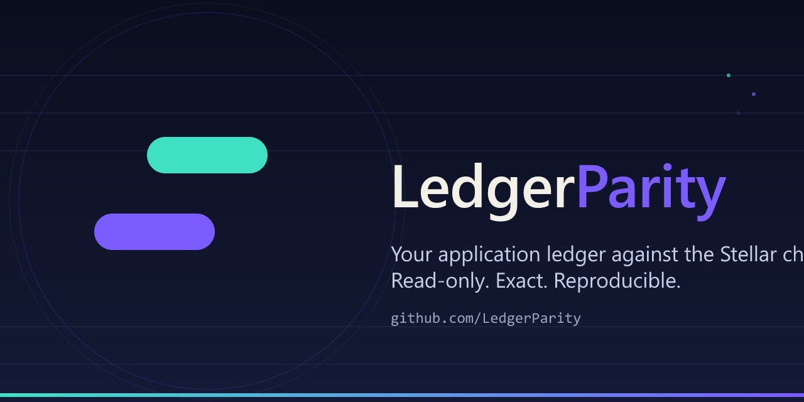

# ledger-parity-connectors



[](https://go.dev/dl/)
[](LICENSE)
[](.github/workflows/ci.yml)

Validated JSON/CSV application-payment exports for LedgerParity's read-only Stellar reconciliation. This library owns input mapping; [core](https://github.com/LedgerParity/ledger-parity-core) owns matching and Horizon ingestion; [CLI](https://github.com/LedgerParity/ledger-parity-cli) owns the runnable operator workflow.

The [SDP 7.0.0 CSV adapter](docs/SDP.md) maps a pinned upstream export contract with explicit sender/network/settlement scope and preserves business references separately. It discards contact fields and rejects unsupported routes. Canonical JSON/CSV also accept `business_reference` and `settlement_start`/`settlement_end` instead of `timestamp`; intervals crossing a filter boundary fail rather than disappear. This is synthetic contract-test coverage, not deployed SDP validation.

From this checkout alone, with Go 1.22.2+:

```sh
go test ./...
go vet ./...
go build ./...
```

The core dependency is pinned to a published Git revision in go.mod/go.sum. No sibling checkout or replacement directive is required.

Use `file.NewFileConnector(path, "json", "your-app")` and `FetchInternalPayments(context.Background(), connector.Filter{})`. The supported source is an array of canonical `types.InternalPayment` records. CSV uses exact canonical field names: id, source_app, network, operation_type, operation_id, reference_id, sender, recipient, amount, asset, asset_type, asset_issuer, asset_contract, timestamp, status. Unknown/duplicate CSV columns, unknown JSON fields, malformed amounts and timestamps fail. All rows validate before filtering; limits return an error rather than silently truncate. A valid empty export is `[]`, not null.

Required: ID, exact network passphrase, operation_type `payment`, sender, recipient, positive decimal-string amount (at most seven places), asset/type (and issuer for credit assets), RFC3339 timestamp (or explicit settlement interval) and status. Native XLM has type native and no issuer. Source app defaults to the connector name. Operation ID is recommended; reference ID means transaction hash, never memo. Unsupported contract tokens are rejected. For a complete runnable fixture see CLI examples/.

`database` accepts a caller-supplied row fetch function, not a built-in SQL connection. Return exact decimal text/bytes, json.Number or integral values for amounts; float32/float64 and missing values are rejected. Missing timestamps are errors. Its mapping can preserve network, operation ID/type and issuer. The caller still owns export completeness and must validate mapped records before asserting coverage.

`stellopay`, `facilpay` and `trustlesswork` are **experimental local-schema examples, not verified integrations**. Their test data is synthetic, and legacy records may lack required identity. They preserve decimal JSON numbers exactly and reject malformed timestamps, but they do not establish upstream compatibility or settlement. They are not selected by the supported CLI. See [provenance](docs/PROVENANCE.md) before using or extending them.

[Contributing](CONTRIBUTING.md) · [tasks](docs/backlog.md) · [security](SECURITY.md) · [MIT](LICENSE). Developer preview; no partnership, adoption or Drips acceptance is claimed.
